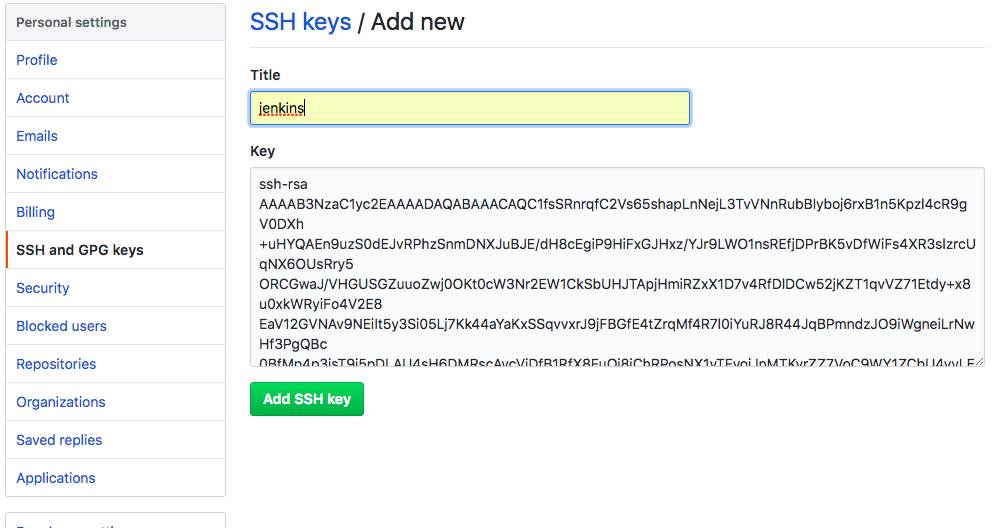
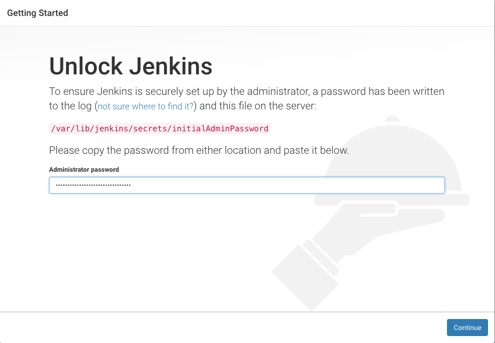

# CI/CD With Git Jenkins Artifactory And ELK Stack

## Connect to AWS

```
For an Amazon Linux AMI, the user name is ec2-user.

For a Centos AMI, the user name is centos.

For a Debian AMI, the user name is admin or root.

For a Fedora AMI, the user name is ec2-user or fedora.

For a RHEL AMI, the user name is ec2-user or root.

For a SUSE AMI, the user name is ec2-user or root.

For an Ubuntu AMI, the user name is ubuntu or root.
```

```
$ ssh -i /Users/apple/Workspace/90-Config/10-KeyPair/aws_thanhlam297_key_pair.pem centos@ec2-54-149-226-94.us-west-2.compute.amazonaws.com
```

## Installation and Configuration

### Downloads 

```
$ sudo yum install zip unzip -y
$ sudo yum install wget
$ sudo yum install vim
$ sudo yum install git
$ mkdir downloads
```
* Tomcat
```
$ wget http://mirrors.viethosting.com/apache/tomcat/tomcat-8/v8.5.29/bin/apache-tomcat-8.5.29.tar.gz
$ tar -xvzf apache-tomcat-8.5.29.tar.gz
```
* Maven
```
$ wget http://mirrors.viethosting.com/apache/maven/maven-3/3.5.3/binaries/apache-maven-3.5.3-bin.zip
$ unzip apache-maven-3.5.3-bin.zip
```

* Elastisearch
```
$ wget https://artifacts.elastic.co/downloads/elasticsearch/elasticsearch-6.2.3.zip
$ unzip elasticsearch-6.2.3.zip
```

* Kibana
```
$ wget https://artifacts.elastic.co/downloads/kibana/kibana-6.2.3-linux-x86_64.tar.gz
$ tar -xvzf kibana-6.2.3-linux-x86_64.tar.gz
```

* Logstash
```
$ wget https://artifacts.elastic.co/downloads/logstash/logstash-6.2.3.zip
$ unzip logstash-6.2.3.zip
```

* Jfrog Artifactory
    * Download [Jfrog Artifactory](https://api.bintray.com/content/jfrog/artifactory/jfrog-artifactory-oss-$latest.zip;bt_package=jfrog-artifactory-oss-zip)
```
$ unzip jfrog-artifactory-oss-5.9.1.zip
```

```
$ mkdir devops
$ cd devops
$ sudo cp -R ../downloads/apache-maven-3.5.3 /usr/lib/
$ cp -R ../downloads/apache-tomcat-8.5.29 .
$ cp -R ../downloads/elasticsearch-6.2.3 .
$ cp -R ../downloads/kibana-6.2.3-linux-x86_64 .
$ cp -R ../downloads/logstash-6.2.3 .
$ cp -R ../downloads/artifactory-oss-5.9.1/ .
```

### Config Tomcat

```
$ cd devops/apache-tomcat-8.5.29/conf
$ vi tomcat-users.xml
```

```xml
<role rolename="tomcat"/>
<role rolename="manager-gui"/>
<role rolename="manager-script"/>
<user username="tomcat" password="Aviva@Tomcat" roles="tomcat"/>
<user username="manager" password="Aviva@Manager" roles="tomcat,manager-gui"/>
<user username="jenkins" password="Aviva@Jenkins" roles="manager-script"/>
```

* Config to access from differrent host

```
$ vi  ../webapps/manager/META-INF/context.xml
```

```xml
<Context antiResourceLocking="false" privileged="true" >
  <Valve className="org.apache.catalina.valves.RemoteAddrValve"
         allow="^.*" />
</Context>
```
```
$ cd ../bin
$ chmod +x *.sh
$ ./catalina.sh start
$ tail ../logs/catalina.out
```

### Config Maven

```
$ cd
$ vi .bash_profile
```

```
#maven setting
export M2_HOME=/usr/lib/apache-maven-3.5.3
export M2=$M2_HOME/bin
export PATH=$PATH:$M2
```

```
$ more .bash_profile
$ source ~/.bash_profile
```

### Maven security setting

```
$ mkdir  /home/centos/.m2
$ cd /home/centos/.m2
$ mvn -emp password
{Aorr/QuO7NIH7KAAUEcS3+/wLYyEXEduDHXIJDl8XXs=}
$ vi settings-security.xml
```

```xml
<settingsSecurity> 
    <master>{Aorr/QuO7NIH7KAAUEcS3+/wLYyEXEduDHXIJDl8XXs=}</master> 
</settingsSecurity>
```

```
$ mvn -ep password
{TvNQlTbGvEoH7lhjT/hyC4LCA07SIKfMpai2+FHgHIs=}
$ vi settings.xml
```

```xml
<?xml version="1.0" encoding="UTF-8"?>
<settings>
  <profiles>
    <profile>
      <id>default</id>
      <repositories>
        <repository>
          <id>release</id>
          <name>release</name>
          <url>http://54.212.200.31:8040/artifactory/libs-release-local</url>
          <releases>
            <enabled>true</enabled>
          </releases>
          <snapshots>
            <enabled>false</enabled>
          </snapshots>
        </repository>
        <repository>
          <id>snapshot</id>
          <name>snapshot</name>
          <url>http://54.212.200.31:8040/artifactory/libs-snapshot-local</url>
          <releases>
            <enabled>false</enabled>
          </releases>
          <snapshots>
            <enabled>true</enabled>
            <updatePolicy>always</updatePolicy>
          </snapshots>
        </repository>
      </repositories>
    </profile>
  </profiles>
  <activeProfiles>
    <activeProfile>default</activeProfile>
  </activeProfiles>
  <servers>
    <server>
      <id>release</id>
      <username>admin</username>
      <password>{TvNQlTbGvEoH7lhjT/hyC4LCA07SIKfMpai2+FHgHIs=}</password>
    </server>
    <server>
      <id>snapshot</id>
      <username>admin</username>
      <password>{TvNQlTbGvEoH7lhjT/hyC4LCA07SIKfMpai2+FHgHIs=}</password>
    </server>
  </servers>
</settings>

```


### Install Java 8

```
$ scp -i /Users/apple/Workspace/90-Config/10-KeyPair/aws_thanhlam297_key_pair.pem jdk-8u161-linux-x64.tar.gz ec2-user@ec2-54-245-142-22.us-west-2.compute.amazonaws.com:~/downloads/
$ cd downloads
$ tar -xvzf jdk-8u161-linux-x64.tar.gz
$ sudo cp -R jdk1.8.0_161 /usr/lib/jvm/
```

* Set Java environment
```
$ cd
$ vi .bash_profile
```
```
# java setting
export JAVA_HOME=/usr/lib/jvm/jdk1.8.0_161
export PATH=$PATH:$JAVA_HOME/bin
```
```
$ more .bash_profile
$ source ~/.bash_profile
```
* Enter the following commands to inform about the Java's location. 
```
$ sudo update-alternatives --install "/usr/bin/java" "java" "/usr/lib/jvm/jdk1.8.0_161/bin/java" 0
$ sudo update-alternatives --install "/usr/bin/javac" "javac" "/usr/lib/jvm/jdk1.8.0_161/bin/javac" 0
$ sudo update-alternatives --set java /usr/lib/jvm/jdk1.8.0_161/bin/java
$ sudo update-alternatives --set javac /usr/lib/jvm/jdk1.8.0_161/bin/javac
```

* To verify the setup enter the following commands 
```
$ update-alternatives --list java
$ update-alternatives --list javac
```
### Install and Configuration Jfrog Artifactory
```
$ cd devops/artifactory-oss-5.9.1/bin
$ ./artifactory.sh
```
* http://localhost:8040/

* Skip Set Admin Password
* Skip Configure a Proxy Server
* Create Repositories: Chose maven


* Default Username: admin
* Default Passord: password

### Generate and adding a new SSH key to your GitHub account


```
$ ssh-keygen -t rsa -b 4096 -C "thanhlam297@gmail.com"
$ eval "$(ssh-agent -s)"
$ ssh-add -K ~/.ssh/id_rsa
$ more < ~/.ssh/id_rsa.pub
```

* Copy key to github


### Config git branch in prompt

```
vi .bash_profile
```

```
#git branch in prompt.
parse_git_branch() {
    git branch 2> /dev/null | sed -e '/^[^*]/d' -e 's/* \(.*\)/ (\1)/'
}

#prompt settings
export PS1="\u@\h \w\[\033[34m\]\$(parse_git_branch)\[\033[00m\]$"
```

```
$ source .bash_profile
```

### Configure for SCM and Artifactory

* Add to pom.xml in Spring Boot Project

```xml
<distributionManagement>
  <repository>
    <id>release</id>
    <name>releases</name>
    <url>http://54.212.200.31:8040/artifactory/libs-release-local</url>
  </repository>
  <snapshotRepository>
    <id>snapshot</id>
    <name>snapshots</name>
    <url>http://54.212.200.31:8040/artifactory/libs-snapshot-local</url>
  </snapshotRepository>
</distributionManagement>

<scm>
  <connection>scm:git:git@github.com:lamnguyen297/devops.git</connection>
  <developerConnection>scm:git:git@github.com:lamnguyen297/devops.git</developerConnection>
  <url>git@github.com:lamnguyen297/devops.git</url>
  <tag>HEAD</tag>
</scm>

<plugin>
  <groupId>org.apache.maven.plugins</groupId>
  <artifactId>maven-release-plugin</artifactId>
  <version>2.5.1</version>
  <configuration>
    <tagNameFormat>v@{project.version}</tagNameFormat>
    <autoVersionSubmodules>true</autoVersionSubmodules>
  </configuration>
</plugin>

```

### Install and Configuration Jenkins

```
$ sudo wget -O /etc/yum.repos.d/jenkins.repo https://pkg.jenkins.io/redhat-stable/jenkins.repo
$ sudo rpm --import https://pkg.jenkins.io/redhat-stable/jenkins.io.key
$ sudo yum install jenkins
$ sudo service jenkins start
```

* Jenkins Home: `/var/lib/jenkins/`

* Go http://ec2-54-149-77-190.us-west-2.compute.amazonaws.com:8080/



* Get Administrator password 
```
$ sudo more /var/lib/jenkins/secrets/initialAdminPassword
```

`2d6d611f7d5042c38162f563834d392b`

* Plugins for Jenkins

`Folders`, `OWASP Markup Formatter`, `build timeout`, `Credentials Binding`, `Timstamper`, `Workspace Cleanup`, `Pipeline`, `GitHub Branch Source`, `Pipline: GitHub Groovy Libraries`, `Pipline: Stage View`, `Git`, `SSH Slaves`, `Matrix Authorization Strategy`, `PAM Authentication`, `LDAP`, `Email Extension`, `Mailer`, 

* Setup admin user

```
Username:	lamnguyen  
Password:	Aviva@Jenkins
Confirm password:	Aviva@Jenkins
Full name:	Lam Nguyen
E-mail address:thanhlam297@gmail.com
```

```
$ sudo vi /etc/sysconfig/jenkins
```
* change JENKINS_PORT="8090"

```
$ sudo service jenkins status
$ sudo service jenkins stop
$ sudo service jenkins start
$ sudo service jenkins restart
```
* copy maven setting to jenkins

```
$ sudo cp .m2/*.xml /var/lib/jenkins/.m2
```

* `Manage Jenkins` -> `Manage Plugins` -> `Available` tab to install plugins below:

    Conditional Buildstep, Deploy to container, Environment Injection, Git Parameter, SonarQube Scanner

* On left navigation, `Manage Jenkins` -> `Global Tool Configuration`:

* Config JDK

    - JDK Name : JAVA
    - Get JAVA_HOME and pate to JAVA_HOME field
    ```
    $ echo $JAVA_HOME
    /usr/lib/jvm/jdk1.8.0_161
    ```
* Config Maven

    - Maven Name : maven
    - Get maven hom and pate to MAVEN_HOME field
    ```
    $ echo $M2_HOME
    /home/ec2-user/devops/apache-maven-3.5.3
    ```
* Config Jenkins with GitHub

```
$ sudo su jenkins
$ cd
$ ssh -T git@github.com
$ git config --global user.name "jenkins"
$ git config --global user.email thanhlam297@gmail.com
```
* Create New Job on Jenkins


